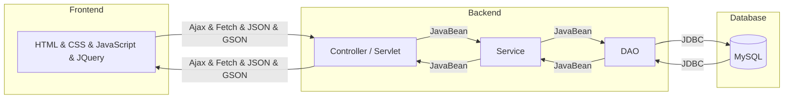
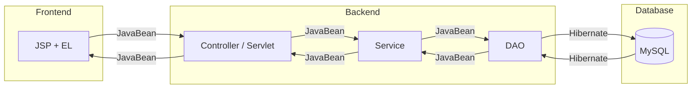

# CGA103G1 - Project Practice ( 旅遊平台 - 揪團活動&討論區 功能實作 ) 
*專題整合 URL︰[CGA103G1 TravelPlatform](https://github.com/MyCorpLexTW/CGA103G1)*
## 目錄 TOC
1. [揪團活動 Activity](#揪團活動)
   - [使用技術 Tech](#使用技術)
   - [實作功能說明 Function Description](#實作功能)
2. [討論區 Forum](#討論區)
   - [使用技術 Tech](#使用技術)
   - [實作功能說明](#實作功能)
3. [ProjectTree](#ProjectTree)


### 揪團活動
#### 使用技術

#### 實作功能
會員可於平台上使
1. 創建 揪團活動
2. 加入 任一 其他會員所創立之揪團活動
3. 於活動瀏覽頁搜尋

### 討論區
#### 使用技術

#### 實作功能


# ProjectTree
```bash
.
|-- pom.xml
`-- src
    `-- main
        |-- java
        |   `-- com
        |       |-- ac
        |       |   |-- controller
        |       |   |   |-- CreateAcServlet.java
        |       |   |   |-- GetOneAcServlet.java
        |       |   |   `-- UpdateAcServlet.java
        |       |   `-- model
        |       |       |-- AcDAO.java
        |       |       |-- AcDAOImpl.java
        |       |       |-- AcDAOImplTest.java
        |       |       |-- AcService.java
        |       |       |-- AcServiceImpl.java
        |       |       `-- AcVO.java
        |       |-- ac_pic
        |       |   |-- controller
        |       |   |   `-- GetOneAcImageServlet.java
        |       |   `-- model
        |       |       |-- AcPicDAO.java
        |       |       |-- AcPicService.java
        |       |       |-- AcPicVO.java
        |       |       `-- I_AcPicDAO.java
        |       |-- act
        |       |   |-- controller
        |       |   |   |-- CreateActServlet.java
        |       |   |   |-- GetActHostServlet.java
        |       |   |   |-- GetAllActServlet.java
        |       |   |   |-- GetMemOneActServlet.java
        |       |   |   |-- GetOneActServlet.java
        |       |   |   |-- GetOwnActServlet.java
        |       |   |   |-- HostQueryAjaxServlet.java
        |       |   |   |-- RedirectDetailPageServlet.java
        |       |   |   |-- UpdateActConditionServlet.java
        |       |   |   `-- UpdateActPeopleAmount.java
        |       |   `-- model
        |       |       |-- ActDAO.java
        |       |       |-- ActJDBCDAO.java
        |       |       |-- ActService.java
        |       |       |-- ActVO.java
        |       |       `-- I_ActDAO.java
        |       |-- act_participant
        |       |   |-- controller
        |       |   |   `-- JoinActServlet.java
        |       |   `-- model
        |       |       |-- ActParticipantDAO.java
        |       |       |-- ActParticipantJDBCDAO.java
        |       |       |-- ActParticipantService.java
        |       |       |-- ActParticipantVO.java
        |       |       `-- I_ActParticipantDAO.java
        |       |-- act_pic
        |       |   |-- controller
        |       |   |   |-- GetAllActPicServlet.java
        |       |   |   |-- GetOneActPicServlet.java
        |       |   |   |-- UpdateActImageServlet.java
        |       |   |   `-- UploadActImageServlet.java
        |       |   `-- model
        |       |       |-- ActPicDAO.java
        |       |       |-- ActPicJDBCDAO.java
        |       |       |-- ActPicService.java
        |       |       |-- ActPicVO.java
        |       |       `-- I_ActPicDAO.java
        |       |-- act_type
        |       |   |-- controller
        |       |   `-- model
        |       |       |-- ActTypeDAO.java
        |       |       |-- ActTypeJDBCDAO.java
        |       |       |-- ActTypeService.java
        |       |       |-- ActTypeVO.java
        |       |       `-- I_ActTypeDAO.java
        |       |-- mem
        |       |   `-- model
        |       |       |-- I_MemDAO.java
        |       |       |-- MemDAO.java
        |       |       |-- MemService.java
        |       |       |-- MemVO.java
        |       |       `-- MemjdbcDAO.java
        |       |-- testany
        |       |   |-- demo
        |       |   |   |-- HibernateQueryPractice.java
        |       |   |   |-- TestDsConn.java
        |       |   |   |-- TestHibernateCRUD.java
        |       |   |   |-- TestJdbc.java
        |       |   |   `-- TestJndi.java
        |       |   `-- model
        |       |       |-- Emp2.java
        |       |       |-- Employee.java
        |       |       |-- Student.java
        |       |       `-- testAc.java
        |       `-- util
        |           |-- CoreDao.java
        |           |-- CoreService.java
        |           |-- DataSourceUtil.java
        |           |-- HibernateUtil.java
        |           |-- JdbcUtil.java
        |           |-- LocalDateTimeDeserializer.java
        |           |-- LocalDateTimeSerializer.java
        |           |-- TestMain.java
        |           |-- TestRedis.java
        |           `-- setSessionValueServlet.java
        |-- resources
        |   `-- hibernate.cfg.xml
        `-- webapp
            |-- META-INF
            |   |-- context.xml
            |   `-- selfUse.txt
            |-- WEB-INF
            |   `-- web.xml
            |-- backend
            |   `-- act
            `-- frontend
                |-- ac
                |   |-- acCardPage.jsp
                |   |-- acCreate.jsp
                |   |-- acDetailPage.jsp
                |   |-- acSelfCardPage.jsp
                |   `-- acUpdate.jsp
                |-- act
                |   |-- actBanner.html
                |   |-- actCreate.html
                |   |-- actDetailJoinPage.html
                |   |-- actMemBanner.html
                |   |-- actMemQuery.html
                |   |-- actMemSideBar.html
                |   |-- actMemUpdate2.html
                |   |-- actSearchListPage.html
                |   |-- footer.html
                |   |-- header.html
                |   |-- memPage.html
                |   |-- ownJS
                |   |-- ......
                |-- assets
                |   |-- ......
                |   `-- ......
                |-- commonCSS.file
                |-- commonJS.file
                |-- footer.file
                |-- header.file
                |-- homePage.js
                |-- homePage.jsp
                |-- homePageBanner.file
                |-- memSidebar.file
                `-- ......
```
