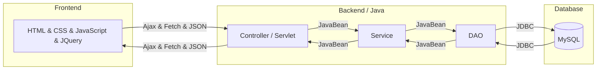
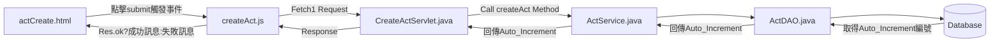
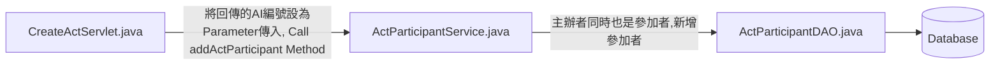
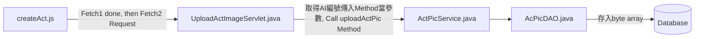
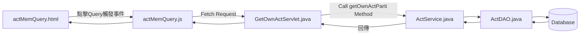
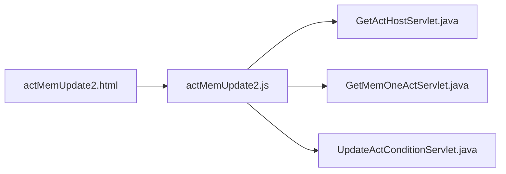
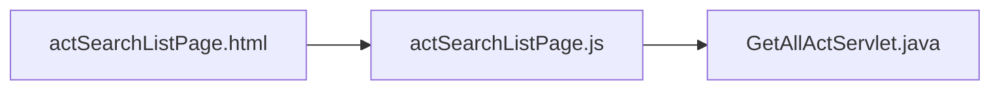
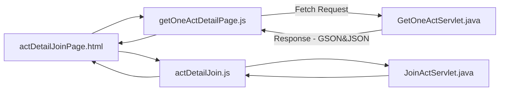
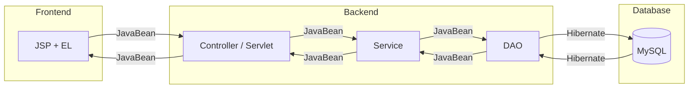

# CGA103G1 - Project Practice ( 旅遊平台 - 揪團活動&討論區 功能實作 ) 
*專題整合 URL︰[CGA103G1 TravelPlatform](https://github.com/MyCorpLexTW/CGA103G1)*

## 目錄 TOC
1. [首頁切版 Home Page - Header Footer 公板](#首頁)
2. [揪團活動 Activity](#揪團活動-Activity)
   - [使用技術 Tech](#Tech)
   - [實作功能說明 Function Description](#實作功能)
     - [會員中心頁面 Member Center](#會員中心頁面)
	     1. [創建揪團活動 Create Activity](#創建揪團活動)
	     2. [查詢揪團紀錄 Query Joined Activity](#查詢揪團紀錄)
	     3. [修改揪團活動條件 Update Member Host Activity Conditions](#修改揪團活動條件)
     - [揪團活動瀏覽頁面 Activity Search Page](#揪團活動瀏覽頁面) 
	     1. [揪團活動查詢 Query Specific Activity](#揪團活動查詢) 
	     2. [加入揪團活動 Join Activity](#加入揪團活動)  
3. [討論區 Forum](#討論區Forum)
   - [使用技術 Tech](#Tech)
   - [實作功能說明 Function Description](#實作功能)
	   - [新增文章頁面 Create an Article](#新增文章頁面) 
	   - [文章瀏覽頁面 Article List Page](#文章瀏覽頁面) 
	   - [文章詳細頁面 One Detailed Article Page](#文章詳細頁面) 
	   - [文章修改頁面 Update Article Content](#文章修改頁面) 
4. [ProjectTree](#ProjectTree)
### 首頁


### 揪團活動
#### Tech

#### 實作功能
**會員可於平台網站內進行以下操作**
##### 會員中心頁面
###### 創建揪團活動



- 會員選擇`創建揪團活動`，跳出
   - 若任一欄位空白或資料有誤，點擊`創建揪團`按鈕，則會回傳`錯誤訊息`於各欄位旁提示
   - 資料填寫完畢並無誤，再次點擊，會顯示`創建揪團活動成功`且將錯誤訊息及欄位資料清空，以方便立刻創建下一個揪團活動，不須刷新頁面。
   - 若後端發生錯誤，回傳失敗，則顯示`創建揪團活動失敗`
###### 查詢揪團紀錄

   - 點擊`查詢已參加之活動` ，會顯示所有已報名參加之活動列表
   - 如無參與任何活動，則回傳訊息`目前您無參加任何活動`

###### 修改揪團活動條件

   - 點擊`查詢主辦之活動列表`，可以列出自己創建的主辦活動編號及標題名稱
   - 若無任何主辦活動，則回傳訊息`目前您無任何主辦活動`
   - 於欄位輸入主辦活動編號，並點擊`搜尋`，可以列出該活動所有資料
   - 再點擊`修改活動條件`，即可修改活動資料，接著點選`儲存`再按`送出更新揪團資料`，修改成功則會回傳成功訊息
   - 若修改欄位有空白處或不符合處，則會顯示錯誤訊息提醒。

##### 揪團活動瀏覽頁面
###### 揪團活動查詢

- 於活動瀏覽頁選擇想要的條件進行`搜尋各類活動`，並產生清單列表 
- 若無揪團活動，則顯示 `目前無任何揪團活動`
- 若進行條件篩選後，無任何符合條件之揪團活動，則訊息顯示`沒有符合篩選之揪團活動`
###### 加入揪團活動

- 點選列表內其中之一活動，進入該活動詳細頁面，
- 點擊`確定加入`按鈕，畫面顯示`加入成功`訊息
- 若已加入過，則回傳訊息告知`你已經加入過此活動`
- 如活動人數已達最多人數限制，則回傳訊息告知`活動已超過最大人數限制，無法加入`
- 若為其他錯誤，則顯示`加入失敗`

### 討論區Forum
#### Tech

#### 實作功能
**會員可於討論區內進行以下操作**
##### 新增文章頁面
```mermaid
flowchart LR
	
```
- 如輸入欄位空白或不符規範，則顯示`錯誤訊息`提示
- 發表文章成功，則會呈現於文章瀏覽頁面上。
##### 文章瀏覽頁面
```mermaid
flowchart LR
	
```
- 如果討論區沒有任何文章，則顯示`目前沒有文章`
- 有，則以Card呈現 文章圖片、文章標題、文章更新時間、文章內容
##### 文章詳細頁面
```mermaid
flowchart LR
	
```
- 從文章瀏覽頁內點選任一文章，跳轉至該文章詳細頁面，顯示該篇文章所有資訊
##### 文章修改頁面
```mermaid
flowchart LR
	
```
- 點選修改文章，若此篇文章非該會員發表，則顯示錯誤訊息`無權修改此文章`
- 若是，則跳轉至修改頁面，呈現此篇文章所有資料欄位，並進行修改
- 修改欄位若有空白或不符規定，則顯示`錯誤訊息`提醒
- 修改成功後，文章瀏覽頁面及詳細頁面會呈現文章最新資料

### ProjectTree
```bash
.$ tree -L 7 -I 'target|test|imgs|assets|css|fonts|js|webfonts|backend|testany'
|-- pom.xml
`-- src
    `-- main
        |-- java
        |   `-- com
        |       |-- ac
        |       |   |-- controller
        |       |   |   |-- CreateAcServlet.java
        |       |   |   |-- GetOneAcServlet.java
        |       |   |   `-- UpdateAcServlet.java
        |       |   `-- model
        |       |       |-- AcDAO.java
        |       |       |-- AcDAOImpl.java
        |       |       |-- AcDAOImplTest.java
        |       |       |-- AcService.java
        |       |       |-- AcServiceImpl.java
        |       |       `-- AcVO.java
        |       |-- ac_pic
        |       |   |-- controller
        |       |   |   `-- GetOneAcImageServlet.java
        |       |   `-- model
        |       |       |-- AcPicDAO.java
        |       |       |-- AcPicService.java
        |       |       |-- AcPicVO.java
        |       |       `-- I_AcPicDAO.java
        |       |-- act
        |       |   |-- controller
        |       |   |   |-- CreateActServlet.java
        |       |   |   |-- GetActHostServlet.java
        |       |   |   |-- GetAllActServlet.java
        |       |   |   |-- GetMemOneActServlet.java
        |       |   |   |-- GetOneActServlet.java
        |       |   |   |-- GetOwnActServlet.java
        |       |   |   |-- RedirectDetailPageServlet.java
        |       |   |   `-- UpdateActConditionServlet.java
        |       |   `-- model
        |       |       |-- ActDAO.java
        |       |       |-- ActJDBCDAO.java
        |       |       |-- ActService.java
        |       |       |-- ActVO.java
        |       |       `-- I_ActDAO.java
        |       |-- act_participant
        |       |   |-- controller
        |       |   |   `-- JoinActServlet.java
        |       |   `-- model
        |       |       |-- ActParticipantDAO.java
        |       |       |-- ActParticipantJDBCDAO.java
        |       |       |-- ActParticipantService.java
        |       |       |-- ActParticipantVO.java
        |       |       `-- I_ActParticipantDAO.java
        |       |-- act_pic
        |       |   |-- controller
        |       |   |   |-- GetOneActPicServlet.java
        |       |   |   |-- UpdateActImageServlet.java
        |       |   |   `-- UploadActImageServlet.java
        |       |   `-- model
        |       |       |-- ActPicDAO.java
        |       |       |-- ActPicJDBCDAO.java
        |       |       |-- ActPicService.java
        |       |       |-- ActPicVO.java
        |       |       `-- I_ActPicDAO.java
        |       |-- act_type
        |       |   |-- controller
        |       |   `-- model
        |       |       |-- ActTypeDAO.java
        |       |       |-- ActTypeJDBCDAO.java
        |       |       |-- ActTypeService.java
        |       |       |-- ActTypeVO.java
        |       |       `-- I_ActTypeDAO.java
        |       |-- mem
        |       |   `-- model
        |       |       |-- I_MemDAO.java
        |       |       |-- MemDAO.java
        |       |       |-- MemService.java
        |       |       |-- MemVO.java
        |       |       `-- MemjdbcDAO.java
        |       `-- util
        |           |-- CoreDao.java
        |           |-- CoreService.java
        |           |-- HibernateFilter.java
        |           |-- HibernateListener.java
        |           |-- HibernateUtil.java
        |           |-- JdbcUtil.java
        |           |-- LocalDateTimeDeserializer.java
        |           |-- LocalDateTimeSerializer.java
        |           |-- ......
        |           `-- setSessionValueServlet.java
        |-- resources
        |   `-- hibernate.cfg.xml
        `-- webapp
            |-- META-INF
            |   |-- context.xml
            |   `-- ......
            |-- WEB-INF
            |   `-- web.xml
            `-- frontend
                |-- ac
                |   |-- acCardPage.jsp
                |   |-- acCreate.jsp
                |   |-- acDetailPage.jsp
                |   |-- acSelfCardPage.jsp
                |   `-- acUpdate.jsp
                |-- act
                |   |-- actBanner.html
                |   |-- actCreate.html
                |   |-- actDetailJoinPage.html
                |   |-- actMemBanner.html
                |   |-- actMemQuery.html
                |   |-- actMemSideBar.html
                |   |-- actMemUpdate2.html
                |   |-- actSearchListPage.html
                |   |-- fontawesome-free-6.1.2-web
                |   |-- footer.html
                |   |-- header.html
                |   |-- memPage.html
                |   `-- ownJS
                |       |-- actDetailJoin.js
                |       |-- actMemQuery.js
                |       |-- actMemUpdate2.js
                |       |-- actSearchListPage.js
                |       |-- createAct.js
                |       |-- getOneActDetailPage.js
                |       |-- includeActBanner.js
                |       |-- includeFooterHeader.js
                |       |-- includePart.js
                |       `-- ......
                |-- commonCSS.file
                |-- commonJS.file
                |-- footer.file
                |-- header.file
                |-- homePage.js
                |-- homePage.jsp
                |-- homePageBanner.file
                `-- memSidebar.file
```
